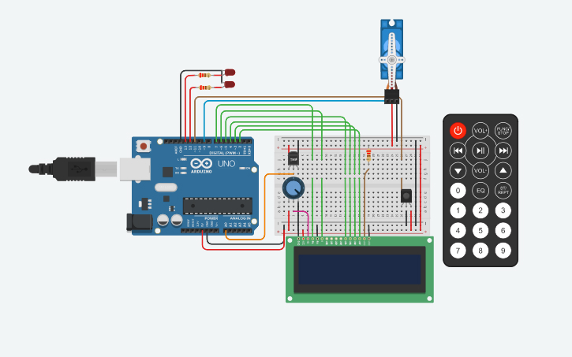
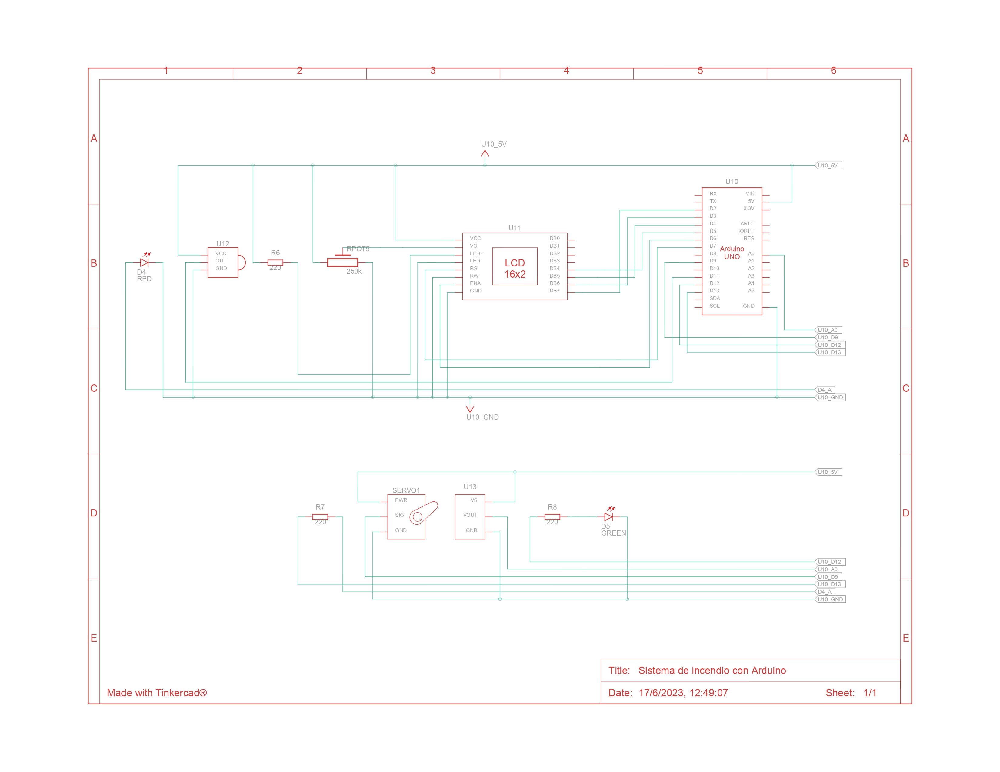

# Sistema de incendio con Arduino
- [Objetivo](#objetivo)
  - [Componentes necesarios:](#componentes-necesarios)
  - [Funcionalidad del sistema:](#funcionalidad-del-sistema)
- [💡 Codificación](#-codificación)
  - [⚙ Ejecucion Principal](#-ejecucion-principal)
  - [🎮 Manejo del control remoto IR](#-manejo-del-control-remoto-ir)
  - [🌈 Estaciones del año](#-estaciones-del-año)
  - [🔥 Mecanismo de Incendio](#-mecanismo-de-incendio)
- [📚 Fuentes](#-fuentes)



👉 [Link del Proyecto](https://www.tinkercad.com/things/bSGTFVQiXpq?sharecode=yO1AjaPWMndwV9LB_MUFfqSypzi1Ht-K6jxOwJCgKCw)  
👉 [Codigo Fuente](code/circuito.ino)

## Objetivo

El objetivo de este proyecto es diseñar un sistema de incendio utilizando Arduino que pueda detectar cambios de temperatura y activar un servo motor en caso de detectar un incendio.  
Además, se mostrará la temperatura actual y la estación del año en un display LCD.

### Componentes necesarios:

* Arduino UNO
* Sensor de temperatura
* Control remoto IR (Infrarrojo)
* Display LCD (16x2 caracteres)
* Servo motor
* Cables y resistencias según sea necesario
* Protoboard para realizar las conexiones
* Dos leds



🔗 Puedes encontrarlo [aqui](assets/Modelo-Esquematico.pdf)  
📑 [Lista de componentes](assets/bom.csv)

### Funcionalidad del sistema:

1. **Conexiones**
   - Conecta el sensor de temperatura al pin analógico A0 de Arduino.
   - Conecta el control remoto IR al pin digital 11 de Arduino.
   - Conecta el display LCD utilizando los pines correspondientes de Arduino.
   - Conecta el servo motor a uno de los pines PWM de Arduino (por ejemplo, pin 9).

2. **Control remoto**
     - Configura el control remoto IR para recibir señales.
    - Define los comandos necesarios para activar y desactivar el sistema de incendio.
    - Utiliza un algoritmo para determinar la estación del año (por ejemplo, rangos de temperatura para cada estación).

3. **Detección de temperatura**
    - Configura el sensor de temperatura y realiza la lectura de la temperatura ambiente.
    - Muestra la temperatura actual en el display LCD.

4. **Sistema de alarma**
    - Define un umbral de temperatura a partir del cual se considera que hay un incendio (por ejemplo, temperatura superior a 60 grados Celsius).
    - Cuando se detecta un incendio (temperatura por encima del umbral), se activa el servo motor para simular una respuesta del sistema de incendio.

5. **Mensajes en el display LCD:**
    - Muestra la temperatura actual y la estación del año en el display LCD.
    - Cuando se detecta un incendio, muestra un mensaje de alarma en el display LCD.


## 💡 Codificación

Comenzamos importando las librerías necesarias para el funcionamiento del proyecto.   
Definimos los pines de cada componente que vamos a utilizar y determinamos el limite de temperatura para que se active la alarma.

- **LiquidCrystal.h**: Para el LCD
- **IRremote.h**: Para el Control IR
- **Servo.h**: Para el Servo Motor

```c++
#include <LiquidCrystal.h>
#include <IRremote.h> 
#include <Servo.h>

#define SENSOR_TEMPERATURA A0
#define LED_1 13
#define LED_2 12 
#define CONTROL_IR 11
#define SERVOMOTOR 9

#define limiteTemperatura 50
```

Instanciamos los objetos que vamos a utilizar en el proyecto.

- **lcd**: Recibe los parametros de los pines del LCD
- **irRecibidor**: Recibe como parametro el pin del control IR
- **servoMotor**: Se utiliza para controlar el servomotor

```c++
LiquidCrystal lcd(7, 6, 5, 4, 3, 2); 

IRrecv irRecibidor(CONTROL_IR); 
decode_results irDato; 

Servo servoMotor; 
```

Luego declaro las variables globales:

- **temperatura**: Guarda la temperatura leida por el sensor
- **encendido**: Indica si el sistema esta encendido o apagado
- **estacion**: Guarda la estacion del año

```c++
int temperatura; 
bool encendido = false; 
String estacion; 
```

### ⚙ Ejecucion Principal

Dentro del void `setup()` inicializamos los componentes que vamos a utilizar.  
Inicializamos los pines de los leds como salida, el LCD con 16 columnas y 2 filas, el servo motor y el control IR.

- **temperaturaLeida**: Recibe un valor de 0 a 1023 a travez de la lectura del sensor de temperatura.
- **temperatura**: Mapea el valor de temperaturaLeida a un rango de -40 a 125, que son los limites del sensor de temperatura.

```c++
void setup()
{
  pinMode(LED_1, OUTPUT);
  pinMode(LED_2, OUTPUT);

  int temperaturaLeida = analogRead(SENSOR_TEMPERATURA); 
  temperatura = map(temperaturaLeida, 20, 350, -40, 125); 

  lcd.begin(16, 2); 
  servoMotor.attach(SERVOMOTOR);
  irRecibidor.begin(CONTROL_IR, DISABLE_LED_FEEDBACK); 
}

void loop()
{
  ControlRemotoIR(); 
  EstacionAnio(temperatura); 

  if (encendido) {
    AlarmaIncendio(temperatura);
    ImprimirTemperatura(temperatura);
    digitalWrite(LED_1, HIGH);
  } else {
    digitalWrite(LED_1, LOW);
    lcd.clear();
  }
}
```

Dentro del void `loop()` se ejecutan las funciones principales del proyecto:

- **ControlRemotoIR**: Controla el sistema con el control remoto.
-  **EstacionAnio**: Indica la estacion del año segun la temperatura actual.

Segun el estado del sistema, se ejecutan las siguientes funciones:

- **AlarmaIncendio**: Activa la alarma de incendio cuando la temperatura supera el limite.
- **ImprimirTemperatura**: Imprime la temperatura actual en el LCD.
- Ademas, se enciende el led 1 cuando el sistema se encuentre encendido.

Cuando el sistema se encuentre apagado, se apaga el led 1 y se limpia el LCD.

### 🎮 Manejo del control remoto IR

La funcion `ControlRemotoIR` se encarga de recibir los datos del control remoto y ejecutar las acciones correspondientes.

Se establecen los siguientes comandos:
- `0xFF00BF00`: Boton de encendido
- `0xF50ABF00`: Boton de subir
- `0xF708BF00`: Boton de bajar

Si se presiona el boton de encendido, se cambia el estado del sistema.  
Si se presiona el boton de subir, se aumenta la temperatura en 5 grados.  
Si se presiona el boton de bajar, se disminuye la temperatura en 5 grados.  

```c++
void ControlRemotoIR()
{
  if (irRecibidor.decode()) {
    switch (irRecibidor.decodedIRData.decodedRawData) {
      case 0xFF00BF00: 
        encendido = !encendido;
        break;

      case 0xF50ABF00: 
        temperatura += 5;
        break;

      case 0xF708BF00: 
        temperatura -= 5;
        break;

      default:
        break;
    }
    irRecibidor.resume(); 
  }
  delay(100);
}
```

Con este bloque de codigo (no está incluido en el codigo) pude determinar el codigo hexadecimal de los botones que utilizo. Antes de ejecutarlo es necesario iniciar el puerto serial el **void setup**.

```c++
  if (IrReceiver.decode()) {        
    Serial.println(IrReceiver.decodedIRData.decodedRawData, HEX);
    IrReceiver.resume();
  }
```

Muestra en el monitor el valor exadecimal la señal que recibe el sensor IR (infrarojo)


### 🌈 Estaciones del año

La funcion `EstacionAnio` se encarga de indicar la estacion del año segun la temperatura actual. Son medidas de referencia. Ajustar a gusto.

En caso de sobrepasar los limites de temperatura deja la cadena vacia para no mostrarla en el display.

```c++
void EstacionAnio(int temp)
{
  if (temp >= 25 && temp <= limiteTemperatura){
    estacion = "Verano";
  } else if (temp >= 15 and temp < 25){
    estacion = "Primavera";
  } else if (temp >= 10 and temp < 15){
    estacion = "Otonio";
  } else if (temp >= -5 and temp < 10){
    estacion = "Invierno";
  }
  else {
    estacion = "";
  }
}

La funcion imprime la temperatura en el LCD junto a la estacion del año.

```c++
void ImprimirTemperatura(int temp)
{
  lcd.clear();
  lcd.setCursor(0, 0);
  lcd.print("Temp: ");
  lcd.print(temp);
  lcd.print("C");
  lcd.setCursor(0, 1);
  lcd.print(estacion);
  delay(600);
}
```

### 🔥 Mecanismo de Incendio

La funcion `PrendeApagaLed` se encarga de prender un led y apagar el otro. Y `EncenderServo` se encarga de girar el servo motor de 0 a 90 grados y viceversa.

```c++
void PrendeApagaLed(int led_1, int led_2)
{
  digitalWrite(led_1, HIGH);
  digitalWrite(led_2, LOW);
}

void EncenderServo(int tiempo)
{
  servoMotor.write(90); 
  PrendeApagaLed(LED_2, LED_1);
  delay(tiempo);
  servoMotor.write(0); 
  PrendeApagaLed(LED_1, LED_2);
  delay(tiempo);
}
```

La funcion `AlarmaIncendio` se encarga de activar la alarma de incendio cuando la temperatura supera el limite.
Limpiando la pantalla y mostrando un mensaje de advertencia. Ademas, de encender el servo motor.

```c++
void AlarmaIncendio(int temp)
{
  if (temp >= limiteTemperatura) {
    lcd.clear();
    lcd.print("Incendio!!!");
    EncenderServo(600);
  }
}  
```

## 📚 Fuentes

➡ [https://programarfacil.com](https://programarfacil.com/blog/arduino-blog/texto-en-movimiento-en-un-lcd-con-arduino/)  
➡ [Sensor de Temperatura y Humedad Arduino DHT11 con Pantalla LCD 💡](https://youtu.be/k9eQEdiEb30)  
➡ [Uso del receptor Infrarrojo Arduino Simulador online TinkerCAD](https://youtu.be/70f5_ZLV4kY)

---

Si deseas contribuir a este proyecto, no dudes en enviar un pull request o abrir un issue en GitHub.